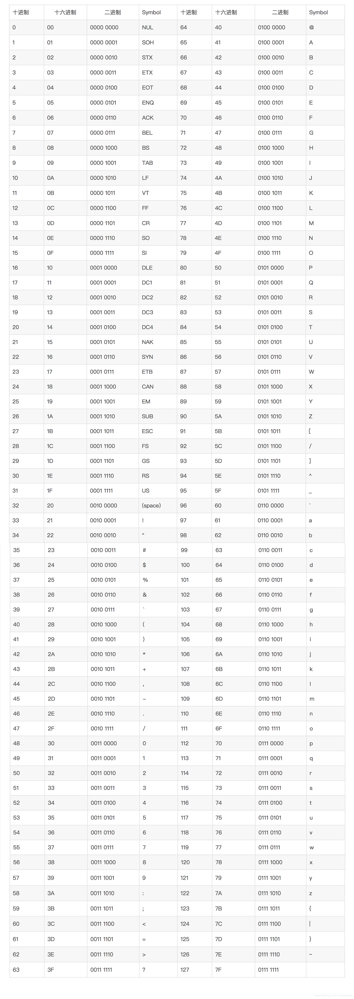

# 11-go运算符

- 算数运算符
- 关系运算符
- 逻辑运算符
- 位运算符
- 赋值运算符
- 其他运算符

## 1.算数运算符
```go
package main

import "fmt"

func main() {
    var a = 10
    var b = 3
    //var c

    fmt.Println(a + b) // 13
    fmt.Println(a - b) // 7
    fmt.Println(a * b) // 30
    fmt.Println(a / b) // 3
    fmt.Println(a % b) // 1 取余，10/3=3余1
    a++                // a = a+1
    fmt.Println(a)     // 11
    a--                // a = a-1,此时a=11
    fmt.Println(a)     //10
}
```

## 2.关系运算符
```go
package main

import "fmt"

func main() {

    a := 10
    b := 20

    // 关系运算符 结果都是bool值
    fmt.Println(a > b)
    fmt.Println(a < b)
    fmt.Println(a >= b)
    fmt.Println(a <= b)
    fmt.Println(a == b) // == 等于  = 赋值
    fmt.Println(a != b)
}
```

## 3.逻辑运算符
假定A的值是True，B的值是False


| 运算符 | 描述                                                           | 实例           |
| :----- | :------------------------------------------------------------- | :------------- |
| &&     | 逻辑and运算符，如果两边操作数都是True，则条件为True，否则为False    | (A&&B)为False  |
| `||`   | 逻辑or运算符，如果两边操作数有一个为True，则条件为True，否则为False | (A`||`B)为Trie |
| ！     | 逻辑not运算符，如果条件为True，则逻辑not结果为False，否则为True     | !(A&&B)为True  |

```go
package main

import "fmt"

func main() {

    a := true
    b := false

    /*
       逻辑与 &&，我与你，我和你都要同时满足一个条件，才执行
       a和b都是真的时候，结果为真，true，只要有一个假，结果就是假
       都为真，结果才是真，否则就是假
       这段if需要a和b同时为true才执行下一行，但是并没有同时满足，所以执行结果为空
    */
    if a == true && b == true {
        fmt.Println(a && b) // 输出为空
    }
}
```
```go
package main

import "fmt"

func main() {

    a := true
    b := false
    /*
       逻辑或 ||， 我或者你，我和你只要有一个满足结果，才执行
       a||b , 只要有一个为真，结果就是真，只有全是false的时候，才会返回假
    */
    fmt.Println(a || b) // print true
}
```

```go
package main

import "fmt"

func main() {

    a := true
    b := false

    /*
       逻辑非 ！，取反，如果是真则为假，假则为真
    */
    fmt.Println(!a) // false
    fmt.Println(!b) // true
}
```

## 4.位运算符(前期学习了解即可)
**进制表在本章最后**
```go
package main

import "fmt"

func main() {
    /*
       位运算：二进制上的01，1为true，0为false
       & 我和你都是1，结果才是1，否则为0
       | 我或者你，有一个为1，结果就是1否则为0
        ^ 不同为1，相同为0
       60 = 0011 1100
       13 = 0000 1101
       --------------
       &    0000 1100 我和你 要同时满足
       |    0011 1101 我或者你 一个满足即可
       ^    0011 0001 不同为1，相同为0
    */
    a := 60
    b := 13
    c := 0

    c = a & b                         // 位运算
    fmt.Printf("%d,二进制%b\n", c, c) // 12,二进制1100,与上面手动计算的结果一致，

    c = a | b                         // 位运算
    fmt.Printf("%d,二进制%b\n", c, c) // 61,二进制 111101,与上面手动计算的结果一致

    c = a ^ b                         // 位运算
    fmt.Printf("%d,二进制%b\n", c, c) // 49,二进制110001,与上面手动计算的结果一致

    // 60,0011 1100 右移2位，去掉最前面二位，不够8位，则在最后补全，得11110000
    c = a << 2
    fmt.Printf("%b\n", c) // 11110000

    // 前面将60改变了，所以这里重新让a=60
    // 0011 1100，左移2位，最后2个0去掉，从前补全两个0，0000 1111
    a = 60
    c = a >> 2
    fmt.Printf("%b\n", c) // 1111
}
```
## 5.赋值运算符
| 运算符                   | 描述                       | 实例                       |
| :---------------------- | :------------------------ | :------------------------ |
| =                       | 将一个表达式得值赋给一个左值 | c=a+b，将a+b表达式结果赋给c |
| +=                      | 相加后再赋值                | c+=a等于c=c+a              |
| -=                      | 相减再赋值                 | c-=a等于c=c-a              |
| *=                      | 相乘再赋值                 | c`*`=a等于c=c`*`a          |
| /=                      | 相除再赋值                 | c/=a等于c=c/a              |
| %=                      | 求余后赋值                 | c%=a等于c=c%a              |
| <<=(以下为位运算符，了解) | 左移后赋值                 | c<<=2等于c=c<<2            |
| >>=                     | 右移后赋值                 | c>>=2等于c=c>>2            |
| &=                      | 按位与赋值                 | c&=2等于c=c&2              |
| ^=                      | 按位异赋值                 | c^=2等于c=c^2              |
| `|`=                    | 按位或赋值                 | c`|`=2等于c=c`|`2          |

```go
package main

import "fmt"

func main() {

    var a int = 21
    var b int

    // = 赋值
    b = a // b = a = 21
    fmt.Println(b)

    // += 加等于
    b += a // b = b(21) + a(21) = 42
    fmt.Println(b)

    // -= *= /= %= 同理
}
```

## 6.其他运算符(了解)
| 运算符 | 描述            | 实例                   |
| :----- | :-------------- | :--------------------- |
| &      | 返回变量存储地址 | &a；将给出变量的实际地址 |
| *      | 指针变量         | *a；是一个指针变量       |


- **进制表**
